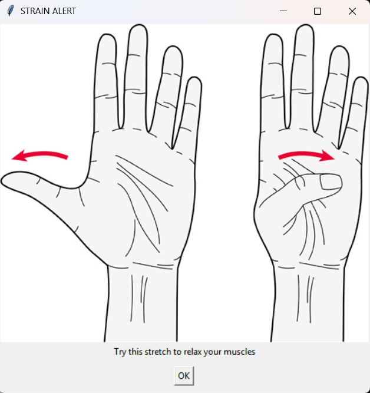
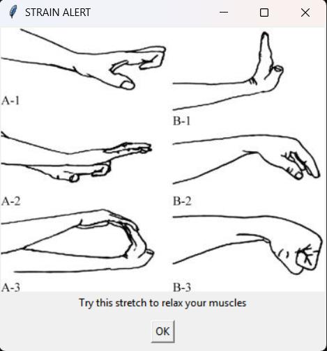

# Deepika Batra ECE 445 Notebook
### 3/6/2025
* Worked on the cost analysis for the design document

### 3/7/2025
Team meeting to work with strain gauges. Refer to [250307](https://github.com/jpadi4/ECE-445-Notebook/blob/main/Team%20Meetings/250307.md)

### 3/10/2025
Team meeting for breadboard demo. Refer to [250310](https://github.com/jpadi4/ECE-445-Notebook/blob/main/Team%20Meetings/250310.md)

**todo**
- Place e-shop order for ATMega328p

### 4/14/2025
Team meeting. Refer to [250414](https://github.com/jpadi4/ECE-445-Notebook/blob/main/Team%20Meetings/250414.md)

**todo**
- Determine how to get initial reading -> likely first index of subsequent readings from each clock cycle (taken by the mcu)
- Check images for stretches
- Add a mapping to the stretches based on MCU output
- We need a way to keep track of how long the user is experiencing strain
- Add a pop up for the user to take a break

### 4/20/2025
Team meeting. Refer to [250420](https://github.com/jpadi4/ECE-445-Notebook/blob/main/Team%20Meetings/250420.md)
* Process for ADC 

```cpp
According to ATMega328p datasheet

U5 (op-amp) output - Vdiff to PC1/ADC1 (pin 24 mcu)
MUX value 1 (0001)
U2 (op-amp) output - Vdiff1 to PC2/ADC2 (pin 25 mcu)
MUX value 2 (0010)
U4 (op-amp) output - Vdiff2 to PC3/ADC3 (pin 26 mcu)
MUX value 3 (0011)

Simple conversion:

- ADEN (ADC enable) should be set to logic 1
- ADMUX bit 7-6 for reference voltage
- ADMUX bit 3-0 for op-amp conversion selection
- Disable power reduction ADC bit (PRADC logic 0)
- Logic 1 to ADC conversion bit (ADSC- bit 6 of ADCSRA) - stays high till conversion is complete
- As ADSC can be used to determine if a conversion is in progress (stays at logic 1) maybe can be used to determine if conversion is complete (logic 0)
- ADC output is 10 bit in the ADC registers (ADCH, ADCL)
```

### 4/21/2025
Team meeting to work with strain gauges and MCU programming. Refer to [250421](https://github.com/jpadi4/ECE-445-Notebook/blob/main/Team%20Meetings/250421.md)
* With new programming cable, we tried to run burn bootloader to program the MCU on the PCB but got a device signature error. We ran it again and got the same error as before which was target does not answer. It is likely that the MCU was damaged due to the voltage provided by connecting the programmer.
* Tested the new programming cable with the ATTiny85 with a simple program that turns on LED.
* Realized a key difference between our schematic and the ISP from the previous assignment was the presence of a zener diode.
* Could not test with the diode as we were out of ATMega328p. Need to order more.
* Realized analogRead() uses internal ADC.

**todo**
- Place e-shop order for new MCU

### 4/22/2025
Team meeting to work on programming the MCU. Refer to [250422](https://github.com/jpadi4/ECE-445-Notebook/blob/main/Team%20Meetings/250422.md)
* Performed continuity checks to ensure MCU and neighboring components need to test MCU are soldered.
* Needed to attach PCB to breadboard to test with the zener diode.
* Able to successfully run burn bootloader.

### 4/23/2025
Team meeting to continue testing the PCB. [250423](https://github.com/jpadi4/ECE-445-Notebook/blob/main/Team%20Meetings/250423.md)
* Performed continuity check for the new attached strain gauge connectors
* Did a voltmeter check to test strain gauge circuit on the PCB
* Realized the op-amps on the PCB were not powered -> solution on the team meeting doc
* Also tried uploading a simple program to the MCU that turns on the LED on the PCB but the upload never terminated.

**todo**
- Look into the issue of upload never terminating while programming MCU.
- Order 10k resistors and any other missing parts

### 4/25/2025
Team meeting to continue testing the PCB and preparing for mock demo. [250425](https://github.com/jpadi4/ECE-445-Notebook/blob/main/Team%20Meetings/250425.md)

### 4/27/2025
Team meeting to work on ensuring current limits are adhered to avoid the MCU from burning out. [250427](https://github.com/jpadi4/ECE-445-Notebook/blob/main/Team%20Meetings/250427.md)

### 4/28/2025
Team meeting to work on new PCB and testing UART. [250428](https://github.com/jpadi4/ECE-445-Notebook/blob/main/Team%20Meetings/250428.md)

### 4/29/2025
Team meeting to figure out UART issues. [250429](https://github.com/jpadi4/ECE-445-Notebook/blob/main/Team%20Meetings/250429.md)

* Worked with Li to debug why UART was not working

    * Plugged in UART cable to PC and verified its connection using device manager
    * The default connection was through COM5 port. To avoid any issues, we switched is to COM2.
    * Cross connected it with MCU so the RX pin on the MCU was connected to the TX pin of the UART cable and TX pin on the MCU was connected to the RX pin of the UART cable
    * Verified the established connection between the PC and the microcontroller by programming the MCU to print to serial monitor

* Wrote a python script that grabs the user data from the COM2 serial port and places the data in a json file.

    * See code here: [generate json data](../Python/readVoltageData.py)

* Wrote a python script that reads user data from the COM2 serial port and prompts a pop up when the data exceeds a certain value.

    * See code here: [notification system](../Python/testNotificationSystem.py)

    

    
