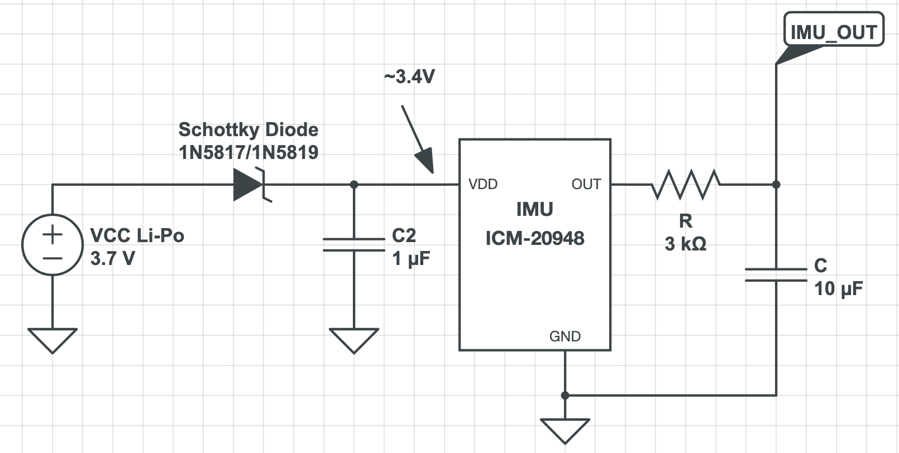

# Li Padilla ECE 445 Notebook
### 2/11/2025
- Set up GitHub repo
- Preparing for first meeting with TA 
- Set up headings and subheadings for project proposal
- Set up team contract document

### 2/13/2025
- created visual aid

### 2/19/2025
- submitted request for strain gauges + IMU

### 2/27/15
- purchase request for strain gauges/IMU cancelled, had to be resubmitted
- created new purchase request for strain gauges/IMUs

### 3/7/2025
- Created the physical design drawing with sensor placements

### 3/9/2025
##### Researching how to display the output voltage of the voltage amplifier


- the MCU will be reading digital input from the strain gauge and then we will eventually be using software-side programming for the communication display subsystem
- ATtiny85 offers A1 (pin 7), A2 (pin 4) and A3 (pin 3) as analog inputs (min voltage for ATtiny85 ADC is 1.1 V)
- should be connecting ; ATTiny85 supports the following Arduino commands:
    pinMode()
    digitalWrite()
    digitalRead()
    analogRead()
    analogWrite()
    shiftOut()
    pulseIn()
    millis()
    micros()
    delay()
    delayMicroseconds()

- ISP cable is only needed for programming the MCU
- serial cable: need USB-to-serial adapter that's connected ot the ATtiny85 
- USB-to-serial adapter (FTDI, CH340, etc.) to send and receive data between the ATtiny85 and computer
    - TX (phys pin 2)/RX (phys pin 3) on ATtiny85 needs to be connected to adapter to send/receive data

**Tentative steps for receiving analog input at MCU**
1. connect op-amp output to analog pin on ATtiny85; in this case, we'll use pin 2/A3/PB3 
2. set ATtiny85 to read analog signal (using an ATtiny85 for breadboard demo); ATtiny85 has ADC to convert analog input into digital input (output is value between 0-1023, corresponding to voltage input rang of 0V to VCC (usually 5V or 3.3V))
3. write code to read analog input to display the value via UART
    - read analog input using `analogRead()` at pin A3
    - convert ADC value into corresponding voltage
    - send information to UART to display in serial monitor

```cpp
// specifies using PB3 as an analog input pin
#define STRAIN_GAUGE_0 7


void setup() {

    // init serial + baud rate
    Serial.begin(9600);

    // wait for serial connection
    while(!Serial)

    // set analog input pin
    // unlike digital input pins, no need to set pinMode
    Serial.println("Reading analog voltage from op-amp...");
}

void loop() {
    // read analog val (0-1023)
    int analogValue = analogRead(STRAIN_GAUGE_0)

    // convert ADC val to voltage; 
    float VCC = 3.3
    float voltage = (analogValue * VCC) / 1023.0;

    // print out voltage at serial (for now)
    Serial.print("Analog Voltage: ");
    Serial.print(voltage);
    Serial.println(" V");

    // delay before the next reading
    delay(500); 
}
``` 

- optionally display as graph using python (?)

### 3/10/2025
- since we don't have a USB for UART yet, but we still want to show that the signal path of strain gauge -> opamp -> MCU -> communication display works, we are going to have MCU connect to an LED and light the LED if a voltage of 1.1V is exceeded (which is the turn-on voltage for the ADC on the MCU itself)

```cpp
#define LED_PIN PIN_PB2   // Pin for LED output
#define STRAIN_GAUGE_0 A1 // specifies using PB3 as an analog input pin


void setup() {
  pinMode(LED_PIN, OUTPUT);
}

void loop() {
    // read analog val (0-1023)
    int analogValue = analogRead(STRAIN_GAUGE_0)

    // convert ADC val to voltage; 
    float VCC = 3.3
    float voltage = (analogValue * VCC) / 1023.0;
    
  if (voltage >= 1.1) {  
    digitalWrite(LED_PIN, HIGH); // Turn on LED
  } else {
    digitalWrite(LED_PIN, LOW);  // Turn off LED
  }
}

```

### 4/1/2025
- downloaded MSP430 programmer; exploring programming options
- recall:
  - inputs:
    - signal from strain gauge (3)
    - signal from IMU
  - outputs:
    - led
    - USB/uart (?)
    - bluetooth

- MSP430FR5994IPM MCU + CC2564CRVMR bluetooth

### 4/2/2025
- new strain gauge placements based on wheatstone bridge configuration
- communication protocol pseudocode for FFT

### 4/6/2025
- create new set up code
- ordered parts to assemble strain gauge on glove itself

### 4/14/2025 
- flesh out full game plan for next meeting

**todo**
- complete new LED code
- complete IMU setup code
- complete complete FFT code
- fleshing out arduino code -> software program planning

### 4/19/2025 
- test LED code uploaded with proper pinouts

**todo**
- complete IMU setup code
- complete complete FFT code
- fleshing out arduino code -> software program planning

### 4/29/2025
#### Independent IMU (ICM-20948) research
##### Powering the IMU
- **problem:** forgot that the operating voltage of the IMU is 1.7V-3.6V, but our VCC Li-Po battery is 3.7V
  - option 1: schottky diode (1N5817 or 1N5819) to lower the voltage ~0.3V



$V_{out}=V_{in} - V_f$
- $V_{in}$ is VCC = 3.7V
- $V_f$ = ~0.3V (voltage drop for diode)
- note that Vf varies w/ current... anticipating a current of roughly 10-30mA; ICM draws < 10mA so $V_f$ is about 0.3V

- **voltage dividers?**
  - only correct when no current is drawn (which the IMU draws)
  - w/ no load: $V_{out} = V_{in} * \frac{R2}{R1+R2}$
  - w/ load (IMU acts as a parallel resistor bc draws current): $V_{out}=V{in} * \frac{R2 || R_{imu}}{R1+(R2||R_{IMU})}$
    - R_imu spikes during sensor reads

##### Reading IMU data
- the LPF is already designed into the IMU output (allows for 5Hz)
- if we integrate the software-side with Python, then it will be easy to time :D !