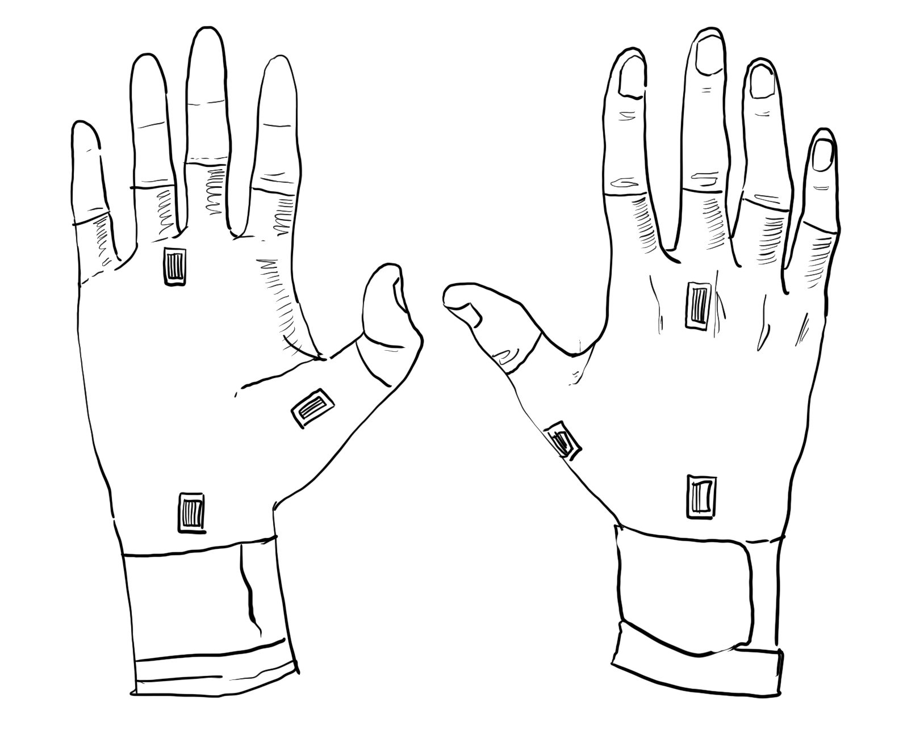

# Li Padilla ECE 445 Notebook
*We mostly did designing & quantitative testing as a team in the lab, so most of my individual lab entries are independent research.* 

### 2/11/2025
#### Objectives
- Set up notebook

#### What was accomplished
- Set up GitHub repo
- Preparing for first meeting with TA 
  - From email:
    1. First draft of Block Diagram
    2. Your three High-Level Requirements
    3. One subsystem requirement
    4. It is highly recommended to finish a rough draft of your entire proposal before the TA meeting to make it most effective.
    5. A permanently bound notebook with numbered pages. This notebook must be used only for senior design and will be turned in at the end of the semester for a grade. Suitable notebooks can be purchased at the ECE shop. If your team has opted for the git repo digital lab notebook, have the structure of the repository set up and ready to look through at the meeting.
    6. Proof of completion of the lab safety training (in-person students only), uploaded to Canvas.
- Set up headings and subheadings for project proposal
- Set up team contract document

### 2/13/2025
#### Objectives
- Work on assigned part of the project

#### What was accomplished
- created visual aid
- fleshed out problem/solution
- refined Sensor Layer Subsystem, Communication Protocol/Display Subsystem and Signal Processing Subsystem Requirements

### 2/19/2025
#### Objectives
- Complete design review
#### What was accomplished
- Overall, received positive feedback about our project
  - Fleshed out R&V tables
  - Not much feedback to change about the overall design (aside from lowering voltage of the battery)
- Submitted request for strain gauges + IMU

### 2/27/15
#### Objectives
- Address email from the ECE department for our parts order beign denied
#### What was accomplished
- Purchase request for strain gauges/IMU cancelled, had to be resubmitted
- Created new purchase request for strain gauges/IMUs

### 3/7/2025
#### Objectives
- Work on assigned parts of the design document (same as proposal, but make sure to elaborate where necessary)

#### What was accomplished
- Created the physical design drawing with tentative sensor placements based on experimentation


### 3/9/2025
#### Objectives
- Researching how to display the output voltage of the voltage amplifier

#### What was accomplished


- the MCU will be reading digital input from the strain gauge and then we will eventually be using software-side programming for the communication display subsystem
- ATtiny85 offers A1 (pin 7), A2 (pin 4) and A3 (pin 3) as analog inputs (min voltage for ATtiny85 ADC is 1.1 V)
- should be connecting ; ATTiny85 supports the following Arduino commands:
    pinMode()
    digitalWrite()
    digitalRead()
    analogRead()
    analogWrite()
    shiftOut()
    pulseIn()
    millis()
    micros()
    delay()
    delayMicroseconds()

- ISP cable is only needed for programming the MCU
- serial cable: need USB-to-serial adapter that's connected ot the ATtiny85 
- USB-to-serial adapter (FTDI, CH340, etc.) to send and receive data between the ATtiny85 and computer
    - TX (phys pin 2)/RX (phys pin 3) on ATtiny85 needs to be connected to adapter to send/receive data

**Tentative steps for receiving analog input at MCU**
1. connect op-amp output to analog pin on ATtiny85; in this case, we'll use pin 2/A3/PB3 
2. set ATtiny85 to read analog signal (using an ATtiny85 for breadboard demo); ATtiny85 has ADC to convert analog input into digital input (output is value between 0-1023, corresponding to voltage input rang of 0V to VCC (usually 5V or 3.3V))
3. write code to read analog input to display the value via UART
    - read analog input using `analogRead()` at pin A3
    - convert ADC value into corresponding voltage
    - send information to UART to display in serial monitor

```cpp
// specifies using PB3 as an analog input pin
#define STRAIN_GAUGE_0 7


void setup() {

    // init serial + baud rate
    Serial.begin(9600);

    // wait for serial connection
    while(!Serial)

    // set analog input pin
    // unlike digital input pins, no need to set pinMode
    Serial.println("Reading analog voltage from op-amp...");
}

void loop() {
    // read analog val (0-1023)
    int analogValue = analogRead(STRAIN_GAUGE_0)

    // convert ADC val to voltage; 
    float VCC = 3.3
    float voltage = (analogValue * VCC) / 1023.0;

    // print out voltage at serial (for now)
    Serial.print("Analog Voltage: ");
    Serial.print(voltage);
    Serial.println(" V");

    // delay before the next reading
    delay(500); 
}
``` 

- optionally display as graph using python (?)

### 3/10/2025
#### Objectives
- Create test program for the breadboard demo

#### What was accomplished
- since we don't have a USB for UART yet, but we still want to show that the signal path of strain gauge -> opamp -> MCU -> communication display works, we are going to have MCU connect to an LED and light the LED if a voltage of 1.1V is exceeded (which is the turn-on voltage for the ADC on the MCU itself)

```cpp
#define LED_PIN PIN_PB2   // Pin for LED output
#define STRAIN_GAUGE_0 A1 // specifies using PB3 as an analog input pin


void setup() {
  pinMode(LED_PIN, OUTPUT);
}

void loop() {
    // read analog val (0-1023)
    int analogValue = analogRead(STRAIN_GAUGE_0)

    // convert ADC val to voltage; 
    float VCC = 3.3
    float voltage = (analogValue * VCC) / 1023.0;
    
  if (voltage >= 1.1) {  
    digitalWrite(LED_PIN, HIGH); // Turn on LED
  } else {
    digitalWrite(LED_PIN, LOW);  // Turn off LED
  }
}

```

### 4/1/2025
#### Objectives
- figure out how to program the TI MCU (different from programming the ATTiny85)

#### What was accomplished
- downloaded MSP430 programmer; exploring programming options
- recall:
  - inputs:
    - signal from strain gauge (3)
    - signal from IMU
  - outputs:
    - led
    - USB/uart (?)
    - bluetooth

- MSP430FR5994IPM MCU + CC2564CRVMR bluetooth

### 4/2/2025
#### Objectives
- flesh out IMU FFT
- draw new diagram for new strain gauge placements

#### What was accomplished
- new strain gauge placements based on wheatstone bridge configuration

- communication protocol pseudocode for FFT
```python
// function to read data from serial port
read_data(num_samples, sampling_rate):
    // init empty buffer to store accelerometer samples
    samples_buffer = empty_array_of_size(num_samples)
    
    // read data from the serial port
    FOR i FROM 0 TO num_samples - 1:
        // Read a sample from the serial port (e.g., x-axis acceleration)
        sample = read_from_serial_port()
        samples_buffer[i] = sample
    
    RETURN samples_buffer

compute_fft(signal, sampling_rate):
    // compute the FFT of the signal
    fft_result = fft(signal)
    
    // compute the magnitude spectrum (absolute values)
    magnitude_spectrum = abs(fft_result)
    
    // compute the frequency bins
    // recall that we want to target frequences <= 5Hz
    num_samples = length(signal)
    frequency_bins = linspace(0, sampling_rate/2, num_samples/2)
    
    // return only the first half (real FFT is symmetric)
    RETURN (frequency_bins, magnitude_spectrum[0:num_samples/2])

main():
    // params (subject to change)
    sampling_rate = 100    // Hz (adjust based on your sensor)
    num_samples = 128      // Number of samples for FFT (power of 2)
    
    // read accelerometer data from serial port
    accelerometer_data = read_serial_accelerometer_data(num_samples, sampling_rate)
    
    // apply window function (e.g., hanning) to reduce leakage
    windowed_signal = accelerometer_data * hanning_window(num_samples)
    
    // compute FFT and frequency spectrum
    (frequencies, spectrum) = compute_fft(windowed_signal, sampling_rate)
    
    // find dominant frequency (optional)
    dominant_freq = frequencies[index_of_max(spectrum)]
    PRINT "Dominant frequency: ", dominant_freq, " Hz"
    
    // plot or further process the FFT results
    plot(frequencies, spectrum)
    
    RETURN 0
```

### 4/6/2025
#### Objectives
- flesh out IMU setup arduino code
#### What was accomplished
- pivoted to using Atmega328p chip instead of TI MCU due to familiarity with Arduino IDE
- create new set up code

```cppp
# first iteration of this program only measured the voltage at the IMU's
# analog pin (e.g., for a light sensor or potentiometer output, not standard IMU data).


#define LED1 PIN_PB2    // Pin for LED1 output
#define LED2 PIN_PD3    // Pin for LED2 output
#define LED3 PIN_PD7    // Pin for LED3 output

#define vdiff PIN_PC1     // Pin for wheatstone bridge 1 signal input
#define vdiff1 PIN_PC2    // Pin for wheatstone bridge 2 signal input
#define vdiff2 PIN_PC3    // Pin for wheatstone bridge 3 signal input

#define imu PIN_PC5       // Pin for IMU signal input

void setup() {
	// sensor layer subsystem inputs
	pinMode(vdiff, INPUT);
	pinMode(vdiff1, INPUT);
	pinMode(vdiff2, INPUT);
	pinMode(imu, INPUT);

	// communication subsystem LEDs
	pinMode(LED1, OUTPUT);
	pinMode(LED2, OUTPUT);
	pinMode(LED3, OUTPUT);

	Serial.begin(9600);  // Initialize serial communication at 9600 baud
}

void loop() {
	Serial.println("Hello World!");  // MCU sends "Hello World" followed by a newline

	// read analog val (0-1023)
	int analogIMU = analogRead(imu);

	// convert ADC val to voltage; 
	float VCC = 3.7;
	float voltageIMU = (analogIMU * VCC) / 1023.0;
	float accel_g = (voltageIMU - (VCC/2)) / 0.3
	
	// 0G is VCC/2 for REGOUT

	// print out analog value
	Serial.print("Acceleration (g): ");
	Serial.println(acceleration_g);
	
	delay(1000);  // Wait 1 second before repeating
}
```
- ordered parts to assemble strain gauge on glove itself

### 4/14/2025 
#### Objectives
- flesh out full game plan for next team meeting

#### What was accomplished
**todo**
- complete new LED code
- complete (refine) IMU setup code
- complete complete FFT code
- fleshing out arduino code -> software program planning

### 4/19/2025 
#### Objectives
- test LED code uploaded with proper pinouts

#### What was accomplished
- programming cable still buggy (figured out that one of the pins was missing)
- replacing the cable allowed us to program the Atmega328p with my test LED code, and the LED correctly lit up.

**todo**
- complete IMU setup code
- complete complete FFT code
- fleshing out arduino code -> software program planning

### 4/29/2025
#### Objectives
* Research how to work with the IMU & FFT

#### What was accomplished
##### Independent IMU (ICM-20948) research
##### Powering the IMU
- **problem:** forgot that the operating voltage of the IMU is 1.7V-3.6V, but our VCC Li-Po battery is 3.7V
  - option 1: schottky diode (1N5817 or 1N5819) to lower the voltage ~0.3V


$V_{out}=V_{in} - V_f$
- $V_{in}$ is VCC = 3.7V
- $V_f$ = ~0.3V (voltage drop for diode)
- note that Vf varies w/ current... anticipating a current of roughly 10-30mA; ICM draws < 10mA so $V_f$ is about 0.3V

- **voltage dividers?**
  - only correct when no current is drawn (which the IMU draws)
  - w/ no load: $V_{out} = V_{in} * \frac{R2}{R1+R2}$
  - w/ load (IMU acts as a parallel resistor bc draws current): $V_{out}=V{in} * \frac{R2 || R_{imu}}{R1+(R2||R_{IMU})}$
    - R_imu spikes during sensor reads

##### Reading IMU data
- the LPF is already designed into the IMU output (allows for 5Hz)
- if we integrate the software-side with Python, then it will be easy to time :D !
