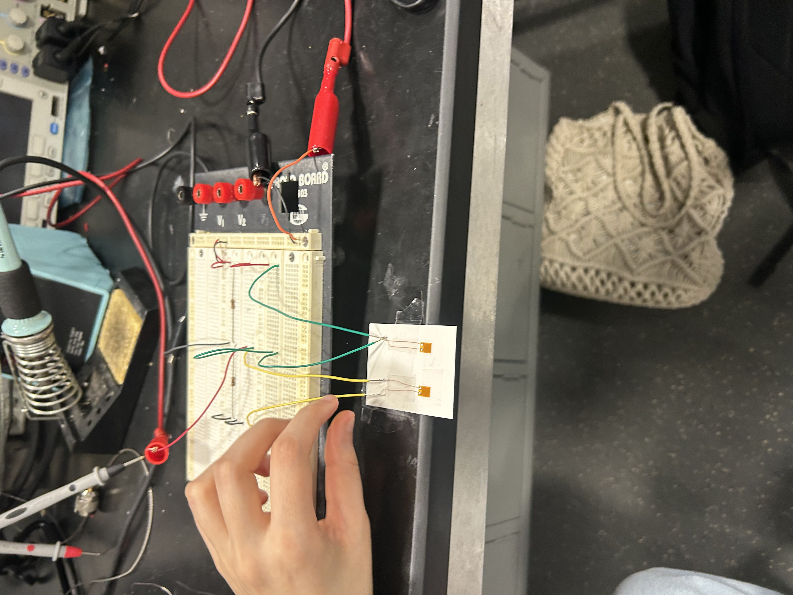
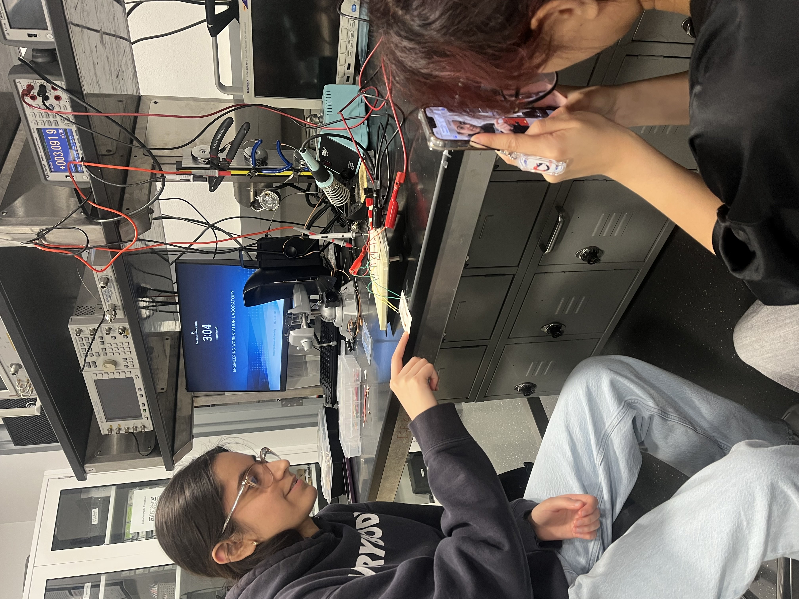
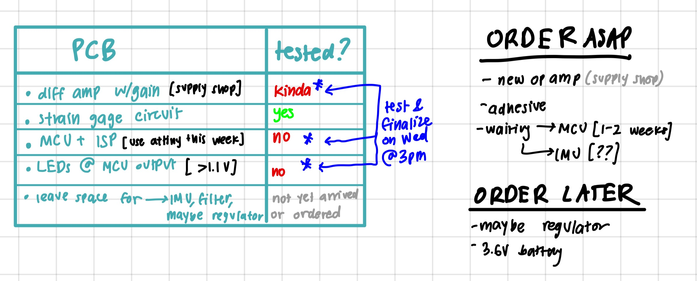

# March 10, 2025
**In attendance:**
- Deepika Batra
- Li Padilla
- Rawnie Singh
- John Li

## Meeting agenda
- Complete breadboard demo
- Figure out why our programmer is not working

## What was accomplished
- Successful breadboard demo, was able to show the strain gauge input gain to ~1.2V and show that the voltages changed when the strain gauges were bending in different directions.
- No quantitative discoveries
- unfortunately don't have a programming cable to download Arduino program onto the MCU
- placed the LED connecting to the MCU, additionally placed the ISP on the breadboard
- John stayed with us to figure out why were getting a "Failed to program SCK" error when programming the MCU on the breadboard
    - Debug messages notified that the ID of the MCU was not identifiable, meaning the microcontroller could not register itself as an ATTiny85
    - Decided that something must be wrong with the programming cable or the microcontroller itself (burnt out)? 

#### Order list
- new op-amp
- MCU
- adhesive for strain gauges
- battery
* waiting for IMus
* voltage regulator(s)?

We have
- differential gain amplifier
- strain gauge circuit/wheatstone bridge
- leave space for IMUs and filter for IMU
- leave space for voltage regulator 
- have to test the new amplifier before printing on new PCB
- 2nd round: place what we have so far
- 3rd round: place everything else that we need
- 4th round: improve space usage/minimize size

