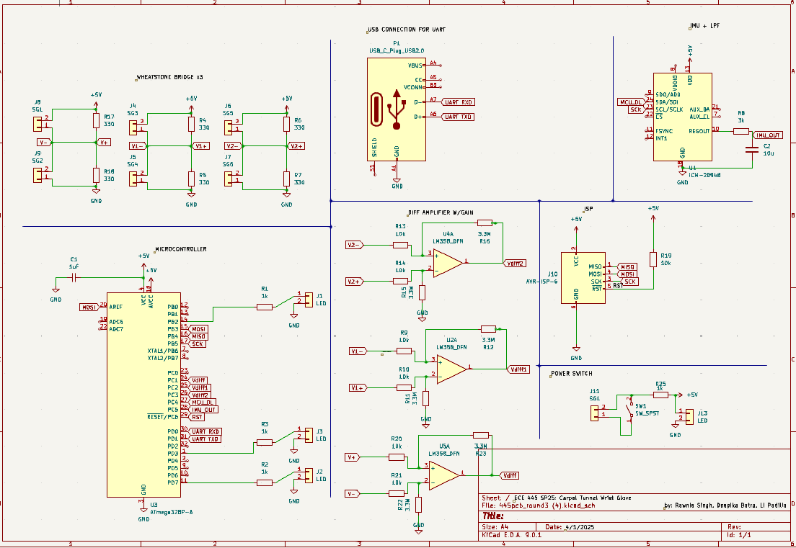
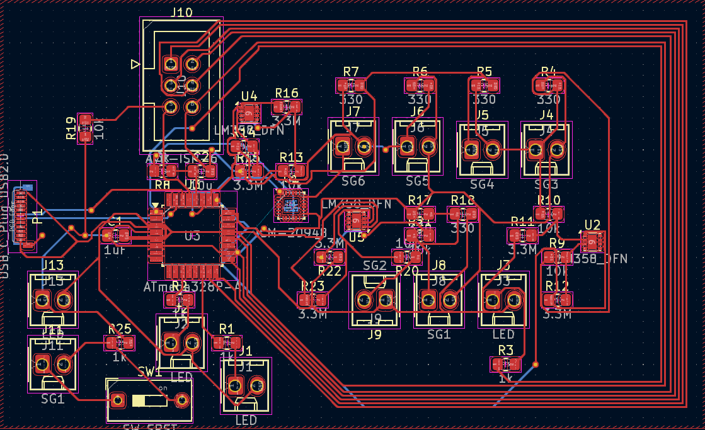
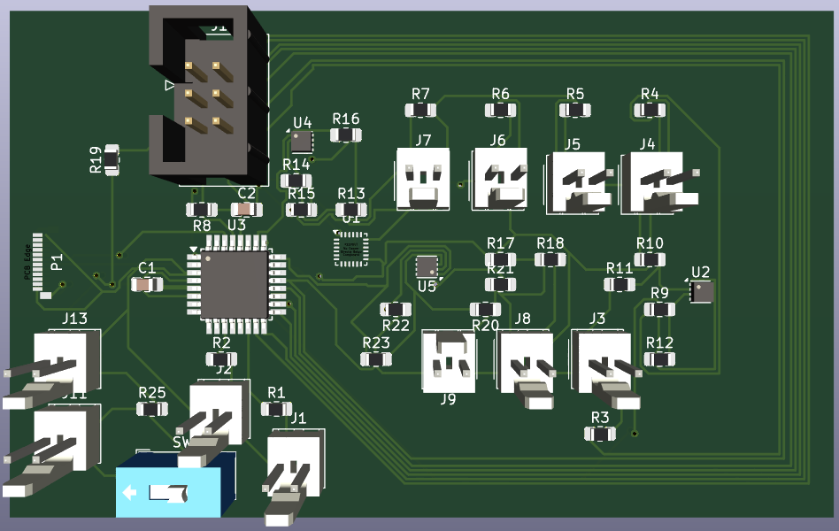

# April 9, 2025
**In attendance:**
- Deepika Batra
- Li Padilla
- Rawnie Singh

## Meeting objectives
- Finalize PCB design

## What was accomplished
#### Order list for surface mount parts
- new sizes for
    - res 3.3M OHM
    - res SMD 3K OHM, 
    - Resistor - 330 Ω (0805)
    - Resistor - 10k Ω (0805)
    - Resistor - 1k Ω (0805)
    - Capacitor - 1 µF (0805)

#### PCB design
- final PCB design with IMU, power switch, etc. designed

## To Do
- Submit PCB Order
- Order parts
