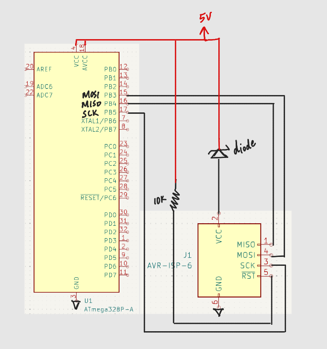

# April 22, 2025
**In attendance:**
- Deepika Batra
- Li Padilla

## Meeting objectives
- solder new MCU 
- test programming MCU
- run burn bootloader, program MCU with no errors

## What was accomplished
- MCU was possibly burnt out due to the high voltage provided by the connection of the programming as well as current passing in both ways
    - could be due to the lack of zener diode on the ISP schematic
- soldered new MCU
- continuity checks for MCU pins pass
- added zener diode between ISP and the VCC on the MCU using breadboard
    - now able to write simple program to the MCU; MCU is detectable by programmer
    - had to add a zener diode to protect the MCU as the MCU is being programmed by the ISP
- soldering/testing 1st strain gauge
    - soldered all of the capacitors/resistors
    - did continuity check on all newly-soldered parts to ensure they are soldered correctly

<figure>
  
  <figcaption style="text-align: center;">Schematic with the addition of zener diode</figcaption>
</figure>