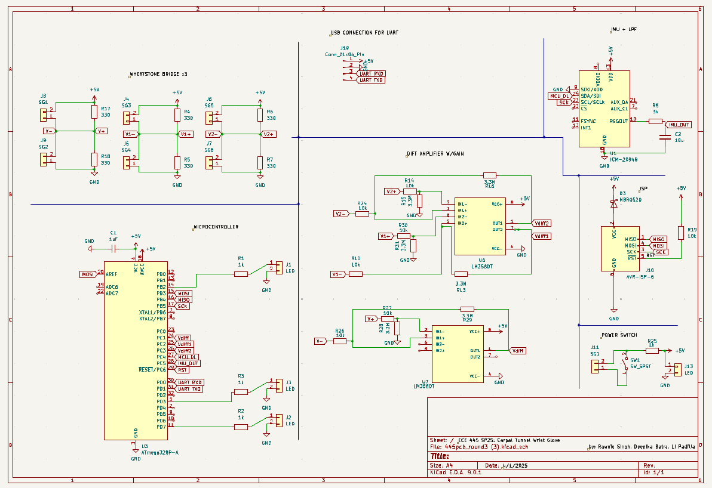

# April 23, 2025
**In attendance:**
- Deepika Batra
- Li Padilla
- Rawnie Singh

## Meeting agenda
- complete soldering all components
- test PCB version of strain gauge
- program test strain gauge test
- mount strain gauges to strain gauge terminals + wires to strain gauge wire components 

## What was accomplished
- soldered all of the strain gauges onto the terminals, crimped the strain gauge wires into the 2x1 mount
- components/designs that have to be changed on the new board
    - addition of zener diode between ISP and MCU
    - power op amp connections (previously was not powered) and change op amp footprint
    - USB connections for UART (since the old UART )
- ordered and created new board

