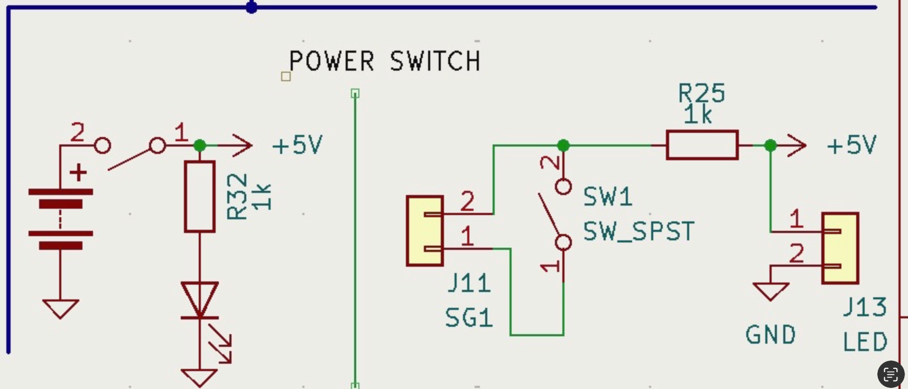

# April 25, 2025
**In attendance:**
- Deepika Batra
- Li Padilla
- Rawnie Singh

## Meeting agenda
- go through R&V tables
- debug circuit design

## What was accomplished
#### Mock Demo
- practiced the mock demo 

#### Debugging
- shorted the MCU due to the switch configuration; Rawnie took off the MCU and Li resoldered a new one on
    - re-soldered MCU passes continuity
- decided to bypass the switch configuration (previous, buggy switch below on the right)
- switch should have been designed as below, on the left

- decided to hold off on mounting the strain gauge onto the glove until we successfully program the MCU with the strain gauge test program
- Rawnie began designing the packaging for the PCB, planning on 3D printing
- figured out why programming the MCU was not working-- "Upload" button is not functional, but `Sketch -> Upload with programmer` was successful. Deepika worked on 
    - simple MCU program to light up LED was successful
- We found another bug. The current from the output of the strain gauge circuit is > 40mA so it fried the MCU again.
    - So we need to do the math and figure out the resistance we need to attach between the output of the opamp and the MCU.
    - idea: we’ll need to breadboard that connection in addition to the new PCB-- should be doable now that we changed the footprint of the opamp on the new PCB to the bigger one 

#### R&V
- Power
- Sensor Layer
- Signal Processing
- Communication Protocol/Display
