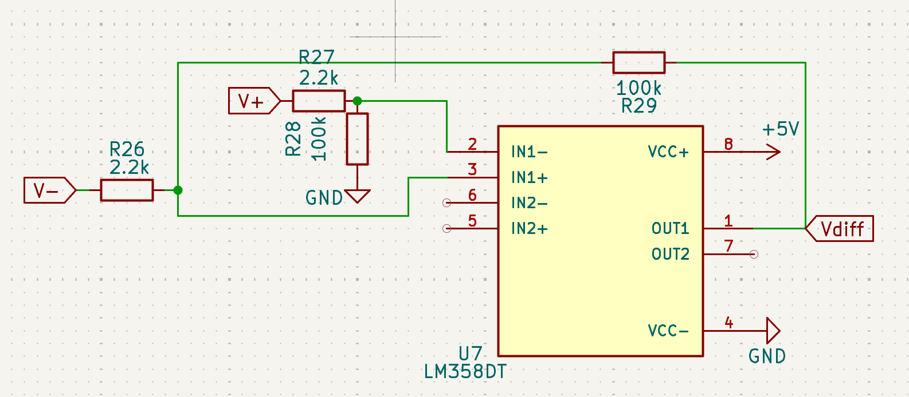

# April 28, 2025
**In attendance:**
- Deepika Batra
- Li Padilla
- Rawnie Singh

## Meeting agenda
- solder new pcb
- change resistors to decrease current (orig 40mA, unsafe for humans + would burn out the pins)

## What was accomplished
#### Signal Processing subsystem
- op amp configuration (rawnie)
    - (the way to reduce current -- reduce the input resistor, increase gain -- increase the bigger resistor)
    - lm348 (3k/2.2k, 100k): 32 mA current to MCU pin, 2.4V 
        - unexpected behavior (next time we turn it on, not sure it'll be the same due to bias currents)
        - since this is the op-amp on the PCB, we're going to try this but if it burns the MCU again we'll switch to the breadboard MCU
    - lm348 (4.7k and 100k): 11.9 mA, 2.4V 
    - mc3307: 0.6 V, 10 mA
        - but would have to be breadboarded

#### Sensor layer subsystem
- strain gauge values (different positions)
    - fist -- went  1 mV
    - rest -- 2.4696 
    - expand: 2.469 
    - **the current the wheatstone bridge (on PCB) are 11mA**
    - **the current across the gauge (that actually touches the glove) is 0.8 microamps-- safe for humans**

#### PCB (new)
- li soldered new MCU, op-amps, resistors
- passed continuinity check of soldered parts
- **testing programming of MCU on new PCB**
- **testing strain gauge on new PCB**
    - op-amp started smoking : (
    - input current to the op-amps is 20mA, but max input current to op-amp is 5mA for DC LM358DT (50mA for AC) ?
    - during our breadboard testing, we were using LM358N which has a max input current of 50mA
    - double-checked the input current to the op-amp, which is just 1mA which shouldn't actually cause an issue
    - the gain in 1 op amp isn't right
- **testing UART/serial write**
    - realized the uart cable was also providing power, while at the same time the PCB was also getting power from an external source; disconnected the UART VCC wire to prevent this conflict
    - realized we had a problem while connecting the UART
        - connected the Rx, Tx, and Gnd pins on the board but when we connected it to the laptop, our op-amp stopped working
        - not exactly sure why but it could be due to interfering connections. We may need to test it with optocouplers (from the images above). I think these are available at self service. 

#### Communication subsystem
- voltage greater than 1: light LED 